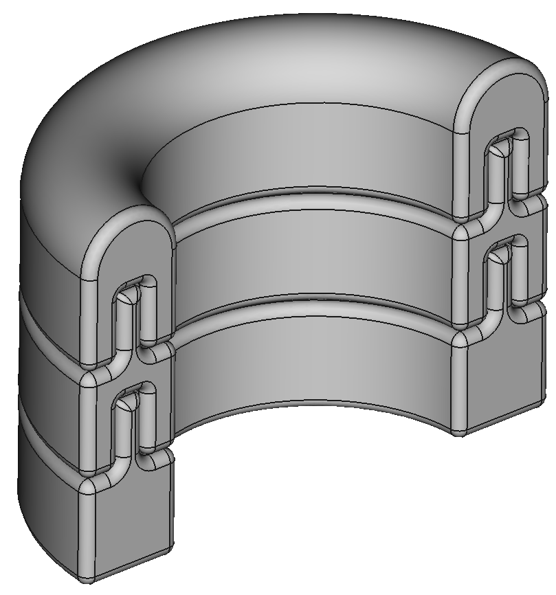
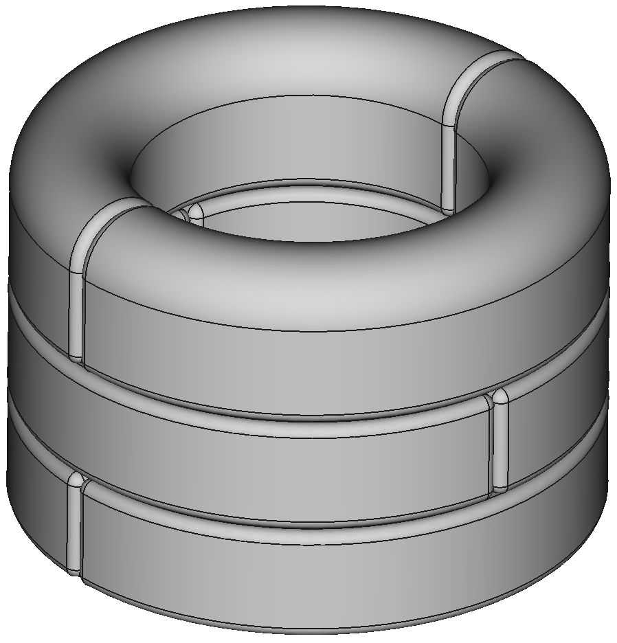
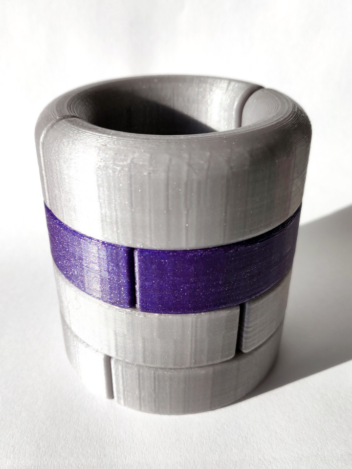

(https://www.buymeacoffee.com/KDxGP)

_STRECHR_ is a stackable stretcher design you can print at home. This is version 1. It is offered in the following sizes:

-   30mm Inner Diameter (see 'STRECHRv1_d30')
-   33mm Inner Diameter (see 'STRECHRv1_d33')
-   36mm Inner Diameter (see 'STRECHRv1_d36')
-   ... you get the idea

_STRECHR_ has three different parts. A top piece, an extension and a flat bottom. The parts you like to use need to be printed twice each.

To ensure that the stacked parts are not coming apart, twist each layer 90 degrees against to others as shown. Stack as many as you like.

Recommended Print Settings:

-   Laxer Height: 0.2 mm
-   Perimeter: 4
-   Infill: 40%
-   no supports

**Happy stretching!**

